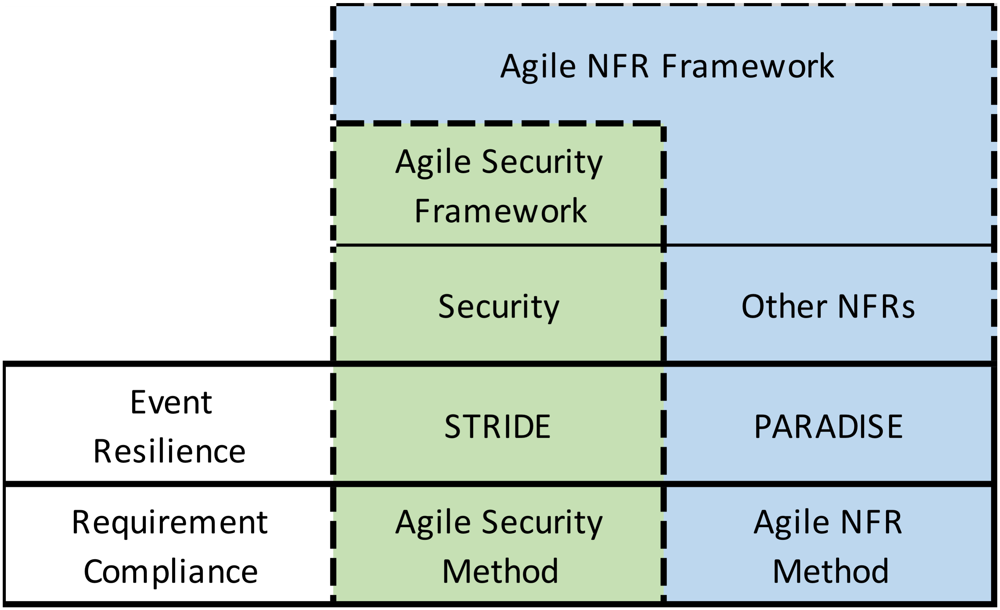

# Agile NFR Framework (ANF)

This repository contains the currently published material for the Agile NFR Framework.

## Overview

The Agile NFR Framework provides an approach for dealing with Non Functional aspects within an Agile project.  It brings together;
- **Agile Security Framework**, which in turn incorporates
  - **Agile Security Method** - a means to ensure that security requirements are addressed
  - **STRIDE** - the Microsoft approach to dealing with Security related incidents
- and the wider NFR aspects;
  - **Agile NFR Method** - an approach to dealing with NFRs in an Agile context
  - **PARADISE** - an approach to dealing with NFR incidents

These are depicted here;

The Framework uses gamification to allow a project to ensure that Non Functional aspects of the solution (especially Security aspects) are thought about during development.  It can be used to demonstrate that the solution being delivered has considered and addressed.  Some of the key strengths of this approach are its ability to engage all developers, and the evolutionary nature of the approach to the creation of evidence and documentation.

## ANF Components

1. [Agile Security Framework](#1-asf)
  - 1.1 [Agile Security Method](#11-asm)
  - 1.2 [STRIDE](#12-stride)
2. [Wider NFRs](#2-nfrs)
  - 2.1 [Agile NFR Method](#21-anm)
  - 2.2 [PARADISE](#22-paradise)
3. [Documentation](#3-documentation)
4. [Training](#4-training)
5. [References](#5-references)

## 1. Agile Security Framework

The Agile Security Framework provides an over-arching technique to addressing Security within an Agile project. It incorporates two techniques.

### 1.1 The NFR Card Game (Security)

The Agile Security Method provides a means to ensure that Security requirements are thought about during the development cycle.  The technique provides a set of cards which allows a gamification approach to ensure that the developers are considering and addressing the Security requirements. You can see an overview of the process by watching this short video: https://www.youtube.com/watch?v=6sxq8ldtZ9M 

### 1.2 STRIDE

STRIDE is a threat classification model developed by Microsoft for thinking about computer security threats. Its name is a mnemonic for the security threats it addresses, with six categories;

  - Spoofing of user identity
  - Tampering
  - Repudiation
  - Information disclosure (privacy breach or data leak)
  - Denial of service (D.o.S)
  - Elevation of privilege

You can see an overview of STRIDE in action by watching this short video here: https://www.youtube.com/watch?v=wL59RopnnOs
See here for more details - https://en.wikipedia.org/wiki/STRIDE_(security)
 
## 2 Wider NFRs 

As well as the Security aspects for a project, the Wider NFRS are also addressed within the Agile NFR Framework.  This falls into two sections.

### 2.1 The NFR Card Game (Wider NFRs)

The Agile NFR Method provides a means to ensure that Non-Functional requirements are thought about during the development cycle.  The technique provides a set of cars which (like the Agile Security Method) allows a gamification approach to ensure that the developers are considering and addressing these NFRs.

### 2.2 PARADISE

PARADISE is a method of ensuring that plausible non-functional events will be correctly handled by the system being developed.  Its name is a mnemonic for the key Non Functional areas which are addressed;

  - Performance 
  - Availability 
  - Reliability 
  - Accessibility
  - Data Management
  - Interoperability
  - Systems Management 

With the final E specifying that this relates to **Events**.

## 3 Documentation

To be populated.  The content will be located [here](docs/)

## 4 Training

To be populated.  The content will be located [here](howto/)
